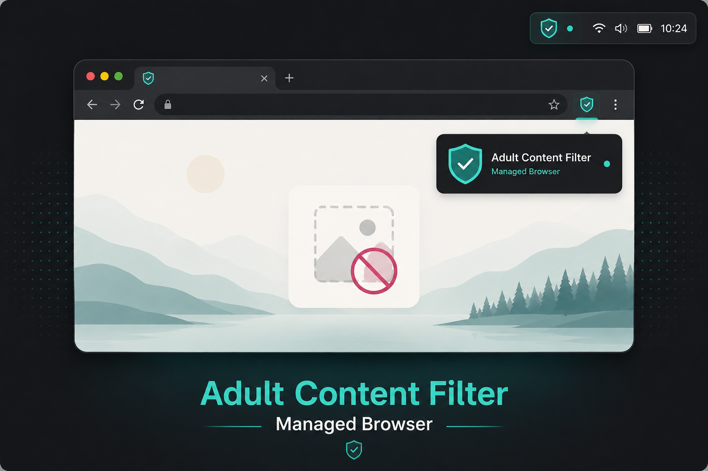

# Omarchy Adult Content Filter



An opt-in Omarchy plugin that launches and supervises a dedicated Chromium session with layered adult-content filtering. Everything except Chromium is bundled in this plugin repository: the Rust supervisor, ONNX Runtime, pinned NudeNet model, adult-domain policy, document cover, and third-party notices travel as one unit.

The plugin leaves your normal Chromium profile and default-browser setting alone. Its bar widget starts one managed browser, reports its state, and stops the same supervised process.

## Install

Requirements:

- Omarchy with plugin support
- The standard Omarchy Chromium package at `/usr/bin/chromium`
- An x86-64 system

Install and enable the plugin:

```bash
omarchy plugin add https://github.com/jaketothepast/omarchy-adult-content-filter
omarchy plugin enable io.github.jaketothepast.adult-content-filter
```

Add **Adult Content Filter** to the right side of the Omarchy bar if it is not added automatically. Left-click the shield to launch the managed browser. Right-click it to stop the browser.

Remove the plugin with:

```bash
omarchy plugin remove io.github.jaketothepast.adult-content-filter
```

No separate package install, root command, or download step is required. The launcher verifies the bundled files before every start, refuses to run as root, keeps the Chromium profile beneath a private `XDG_RUNTIME_DIR`, and permits one supervisor per user.

## Filtering layers

The managed browser applies these layers in order:

1. A pinned adult-domain list rejects matching requests before navigation or media loading.
2. Google searches are rewritten to force SafeSearch, and YouTube requests receive the strict restricted-mode header.
3. A document-start cover prevents unreviewed page imagery from flashing onscreen.
4. Successful static JPEG and PNG responses are inspected locally with the pinned NudeNet ONNX model. Explicit detections are replaced; decode, model, timeout, and policy failures are also replaced.
5. If a blocked image is connected to a media control, that media element is tainted and prevented from playing. Unrelated video on the same page is not automatically blocked.

The browser also denies downloads and DevTools, uses a fresh managed profile, accepts only complete HTTP(S) top-level navigations, and fails closed when intercepted content cannot be safely settled.

Inference runs locally. Telemetry is written only to the launching terminal as bounded JSON records containing stage, verdict, fixture index, and elapsed time; URLs and image bytes are not logged.

## Security boundary

This plugin provides browser-only protection. It does not install a system service, autostart entry, MIME association, default-browser handler, user account, sudo rule, or machine-wide Chromium policy. It does not prevent a user from launching another browser or modifying the machine when that user already has administrative access.

It is therefore an adult-content filtering browser, not a child account or anti-tamper system. Pair it later with a separately reviewed restricted-user policy if the machine must prevent bypass. The classifier, domain list, and browser interception are defense-in-depth controls rather than a promise that every adult page or adversarial rendering will be detected.

Current image inference covers ordinary static JPEG and PNG responses. Canvas, WebGL, CSS background images, encrypted media streams, audio-only content, and hostile browser/OS modification remain outside the demonstrated boundary.

## Bundled identities

- ONNX Runtime 1.27.1 shared library
- NudeNet `320n.onnx` SHA-256 `c15d8273adad2d0a92f014cc69ab2d6c311a06777a55545f2c4eb46f51911f0f`
- StevenBlack `porn-only` hosts data from commit `2bb49d741a2c9b922b0ed59be6c28ce543bed81b`

The launcher verifies `runtime/SHA256SUMS` before starting. Licensing and exact upstream identities are recorded in [THIRD_PARTY_NOTICES.md](THIRD_PARTY_NOTICES.md).

## Develop and verify

The Nix flake pins the host toolchain and all development inputs:

```bash
nix run .#check
nix flake check
```

Useful controlled proofs:

```bash
nix run .#bench -- --iterations 20 --warmups 3 --json
nix run .#run -- --images 17 --flagged-index 5 --hold-millis 1500 --assert-no-flash --json
nix run .#browse
```

The headed proof uses generated color fixtures, so validation never needs to store or download explicit material. It verifies request interception, one deterministic replacement, document covering, media association, privacy-safe metrics, browser cleanup, and model/runtime identity.

The runtime bundle is reproduced from the reviewed Arch recipe:

```bash
OMARCHY_LOCAL_PACKAGE_SRC="$PWD" makepkg -Csf --noconfirm -p packaging/arch/PKGBUILD
scripts/build-plugin-bundle /absolute/path/to/omarchy-adult-content-filter-0.1.0-1-x86_64.pkg.tar.zst
```

See [docs/experiment-results.md](docs/experiment-results.md) for measured host and controlled-VM evidence. Internal Rust identifiers retain their original `omarchy-kids` names for source compatibility; the public plugin ID and command are `io.github.jaketothepast.adult-content-filter` and `omarchy-adult-content-filter`.

## License

Original project code is licensed under `AGPL-3.0-only`. Bundled third-party components retain their own licenses and notices.
